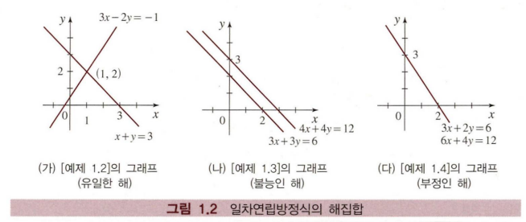
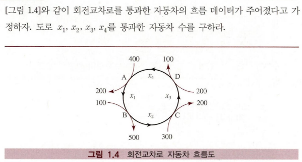

# 제1장 일차연립방정식과 행렬

## 학습목표

- 일차방정식과 연립방정식에서 사용되는 기본 용어를 설명할 수 있다
- 일차방정식 $ax = b$가 어떤 값에서 유일한 해, 불능, 부정이 되는지 판별할 수 있다
- 2원 일차연립방정식을 풀 수 있고, 해당 방정식을 2차원 평면에 그려 기하학적인 의미를 설명할 수 있다
- 일차연립방정식의 응용 사례를 설명할 수 있다

## 1.1 일차연립방정식

### 일차방정식의 기본 개념

일차방정식 $ax = b$에서:
- $a$: 계수(coefficient)
- $b$: 상수(constant)
- $x$: 미지수(unknown)

### 해집합의 분류

일차방정식 $ax = b$의 해집합은 다음 세 가지 경우로 나뉜다:

1. **유일한 해** ($a ≠ 0$인 경우)
    - $x = \frac{b}{a}$ (unique solution)

2. **불능** ($a = 0, b ≠ 0$인 경우)
    - 해가 없음 (no solution, impossible)

3. **부정** ($a = 0, b = 0$인 경우)
    - 무수히 많은 해 (infinite solutions, indeterminate)

### n원 일차연립방정식

n개의 미지수 $x_1, x_2, \ldots, x_n$를 갖는 m개의 일차방정식:

$$\begin{cases}
a_{11}x_1 + a_{12}x_2 + \cdots + a_{1n}x_n = b_1 \\
a_{21}x_1 + a_{22}x_2 + \cdots + a_{2n}x_n = b_2 \\
\vdots \\
a_{m1}x_1 + a_{m2}x_2 + \cdots + a_{mn}x_n = b_m
\end{cases}$$

**중요**: 모든 방정식에서 각 미지수의 차수가 1차여야 한다.

## 1.2 소거법

### 기본 개념

일차연립방정식을 푸는 가장 간단한 방법으로, 한 방정식에서 하나의 미지수를 없애기 위해 적당한 값을 곱한 다음 해당 방정식에 더한다.

### 세 가지 기본연산 (elementary operations)

1. 두 방정식을 교환한다
2. 한 방정식에 0이 아닌 상수를 곱한다
3. 한 방정식에 임의의 상수를 곱하여 다른 방정식을 더한다

### 소거법 예제

**예제**: 다음 2원 일차연립방정식을 소거법으로 풀어라.

$$\begin{cases}
3x - 2y = -1 \\
x + y = 3
\end{cases} \cdots\cdots (1.4)$$

풀이

먼저 다음과 같이 두 방정식의 순서를 바꾸다.

$$\begin{cases}
x + y = 3 \\
3x - 2y = -1
\end{cases} \cdots\cdots (1.5)$$

이제 첫 번째 방정식에 2를 곱하여 두 번째 방정식에 더한다.

$$\begin{cases}
x + y = 3 \\
5x = 5
\end{cases}$$

두 번째 방정식에서 $x$의 계수는 5로 0이 아니므로 $x = 1$이다. 이 값을 첫 번째 방정식에 대입하면 $y = 3 - x = 3 - 1 = 2$이다. 

따라서 연립방정식 (1.4)와 (1.5)는 동일한 해집합을 가지므로 순서쌍 $(1, 2)$는 연립방정식 (1.4)의 해가 된다.

### 후진대입 (back substitution)

소거법으로 구한 값을 다른 방정식에 대입하여 나머지 미지수를 차례로 구하는 과정

### 해집합의 분류

연립방정식의 해집합도 일차방정식과 마찬가지로 세 가지로 분류:

1. **유일한 해** (unique solution)
    - 예: $\begin{cases} x + 2y = -1 \\ 2x - y = 3 \end{cases}$ → $(1, -1)$

2. **해가 없는 경우** (no solution, 불능인 해)
    - 예: $\begin{cases} 3x + 3y = 6 \\ 4x + 4y = 12 \end{cases}$ → $0 = 4$ (모순)

3. **무수히 많은 해** (infinite solutions, 부정인 해)
    - 예: $\begin{cases} 3x + 2y = 6 \\ 6x + 4y = 12 \end{cases}$ → $0 = 0$ (항등식)

### 매개변수를 이용한 해 표현

무수히 많은 해를 갖는 경우, 매개변수 $k$를 사용하여 해집합을 표현한다.

예: $x = k, y = 3 - \frac{3}{2}k$ (단, $k$는 임의의 실수)

무수히 많은 해의 구체적 예제

식 (1.8)의 두 방정식은 식 (1.9)의 방정식에 일정한 수를 곱하여 얻을 수 있다. 따라서 연립방정식 (1.8)은 무수히 많은 해, 즉 부정인 해를 갖는다. 즉, $x = k$라고 하면 $y = 3 - \frac{3}{2}k$가 되어 식 (1.8)의 해집합은 $\left(k, 3 - \frac{3}{2}k\right)$ $k$는 임의의 수가 된다.

여기서 $k$를 매개변수라 하며 해를 서술하기 위해 필요한 변수이다. 예를 들어 $k = 2$이면 $(2, 0)$이, $k = 4$이면 $(4, -3)$이 해가 된다.

## 1.3 일차연립방정식의 응용

### 주요 응용 분야

- 자연과학
- 공학
- 사회과학
- 화학반응식의 균형맞추기
- 부분분수 분해
- 교통 흐름 문제

### 화학반응식 예제

광합성 반응: $kCO_2 + lH_2O \to mC_6H_{12}O_6 + nO_2$

반응 전과 후의 원자 수가 동일하다는 사실을 이용하여 연립방정식을 세운다:

- 탄소(C): $k = 6m$
- 수소(H): $2l = 12m$
- 산소(O): $2k + l = 6m + 2n$

이를 정리하면:
$$\begin{cases}
k - 6m = 0 \\
2l - 12m = 0 \\
2k + l - 6m - 2n = 0
\end{cases}$$

해: $k = 6t, l = 6t, m = t, n = 6t$ (단, $t$는 임의의 양수)

$t = 1$일 때: $6CO_2 + 6H_2O \to C_6H_{12}O_6 + 6O_2$

### 부분분수 분해

유리함수를 더 간단한 부분분수의 합으로 나타내는 방법

예: $\frac{-x-5}{x^2-2x-3} = \frac{a}{x+1} + \frac{b}{x-3}$

양변에 $(x+1)(x-3)$을 곱하면:
$-x-5 = a(x-3) + b(x+1)$

계수를 비교하여:
$$\begin{cases}
a + b = -1 \\
-3a + b = -5
\end{cases}$$

해: $a = 1, b = -2$

따라서: $\frac{-x-5}{x^2-2x-3} = \frac{1}{x+1} - \frac{2}{x-3}$

### 교통 흐름 문제

**예제 1.8**: [그림 1.4]와 같이 회전교차로를 통과한 자동차의 흐름 데이터가 주어졌다고 가정하자. 또한 $x_1, x_2, x_3, x_4$를 통과한 자동차 수를 구하라.

풀이

A 지점으로 들어온 차량의 수는 $400 + x_4$이고, A 지점을 통과해 나간 자동차 수는 $200 + x_1$이다. 유입량과 유출량이 같아야 하므로 $400 + x_4 = 200 + x_1$이고 이를 정리하면 $x_1 - x_4 = 200$이다. 같은 방법으로 B, C, D 지점의 유입량과 유출량을 계산하면 다음 연립방정식을 얻을 수 있다.

$$\begin{cases}
x_1 - x_2 = 400 \\
x_2 - x_3 = -100 \\
x_3 - x_4 = -100 \\
x_1 - x_4 = 200
\end{cases}$$

이 연립방정식은 겉으로 보기에는 방정식의 개수와 미지수의 개수가 같아 유일한 해를 가질 것 같지만 실제로는 부정방정식이다. $x_2 = 0$일 때 $x_1 = 400, x_3 = 100, x_4 = 200$인 특수해를 구할 수 있다. 

교차로의 도로 모두 일방통행이므로 $x_i ≥ 0$이다. 따라서 $x_1 = 400 + n, x_2 = n, x_3 = 100 + n, x_4 = 200 + n$ 이 일반해이다. 즉, 무수히 많은 해를 갖는다.

**왜 무수히 많은 해를 가질까?**

4개의 방정식을 모두 더하면:
$(x_1 - x_2) + (x_2 - x_3) + (x_3 - x_4) + (x_1 - x_4) = 400 + (-100) + (-100) + 200$

좌변을 정리하면: $2x_1 - 2x_4 = 400$, 즉 $x_1 - x_4 = 200$

이는 네 번째 방정식과 동일하므로, 실질적으로는 **독립적인 방정식이 3개**뿐이다. 
따라서: 미지수 4개, 독립적인 방정식 3개 → 무수히 많은 해

## 증명방법론

### 직접증명 (direct proof)

정리가 $p \to q$ 형태일 때, $p$에서 시작하여 $q$를 얻는 방법

**예제**: 두 정수 $x, y$의 합 $x+y$는 짝수이다.

**증명**:
$x, y$를 짝수라 하자.
그러면 $x = 2k, y = 2l$ (단, $k$와 $l$은 정수)
$x + y = 2k + 2l = 2(k+l)$
$k+l$이 정수이므로 $2(k+l)$은 짝수이다.
따라서 $x+y$는 짝수이다.

## 핵심 정리

1. **일차방정식**: 계수와 상수의 값에 따라 유일한 해, 해가 없음, 무수히 많은 해로 분류
2. **소거법**: 기본연산을 통해 연립방정식을 단순화하여 해결
3. **후진대입**: 소거법으로 구한 값을 다른 방정식에 대입하여 나머지 미지수를 구하는 과정
4. **응용**: 자연과학, 공학, 사회과학 등 다양한 분야에서 문제 해결에 활용
5. **증명**: 수학적 정리를 논리적으로 입증하는 방법론