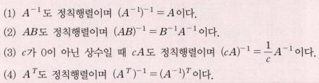
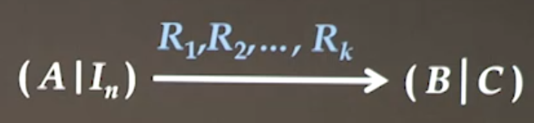
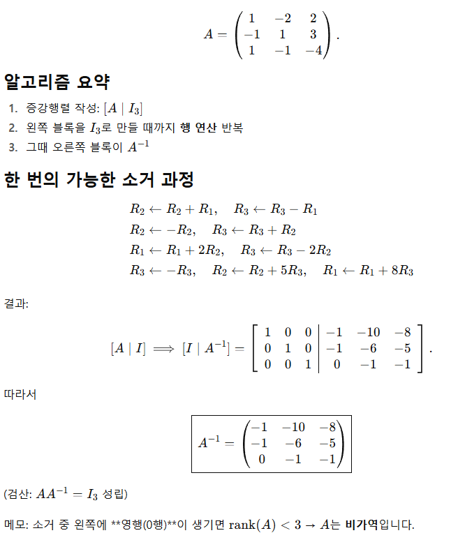
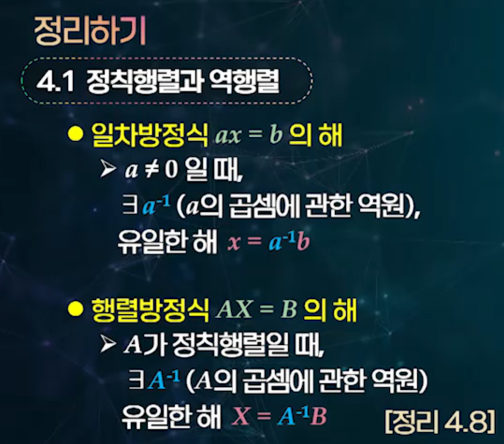
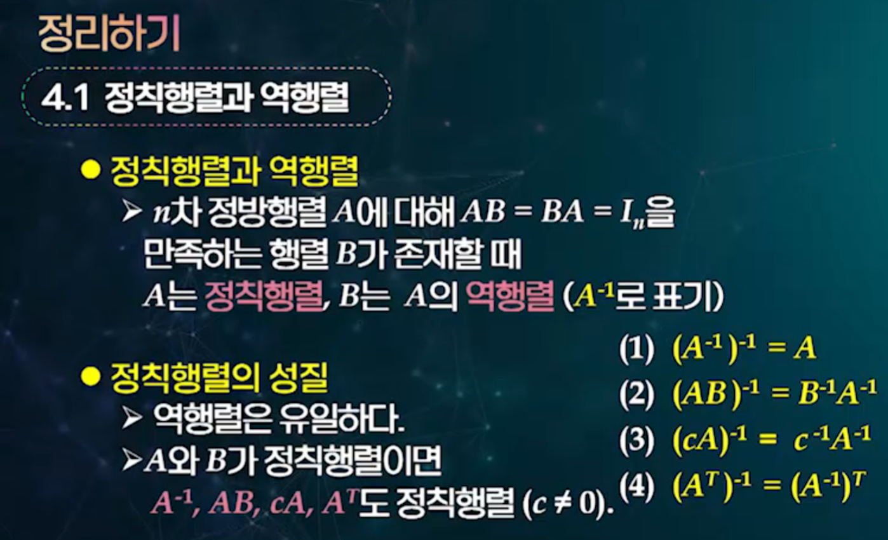
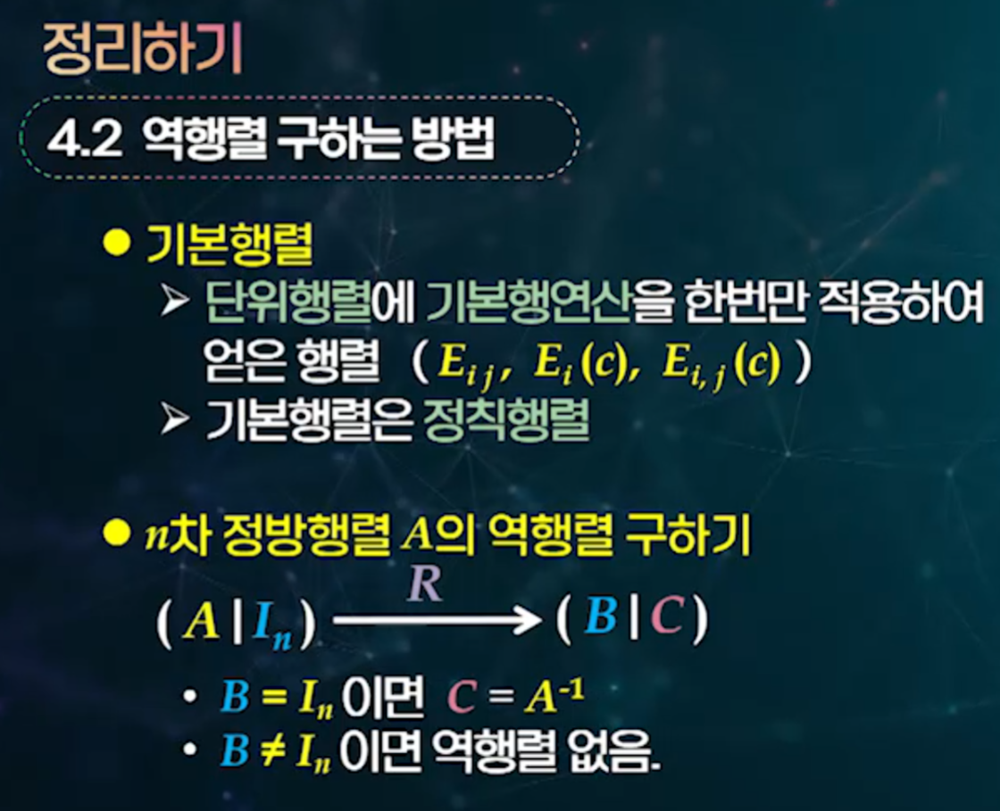
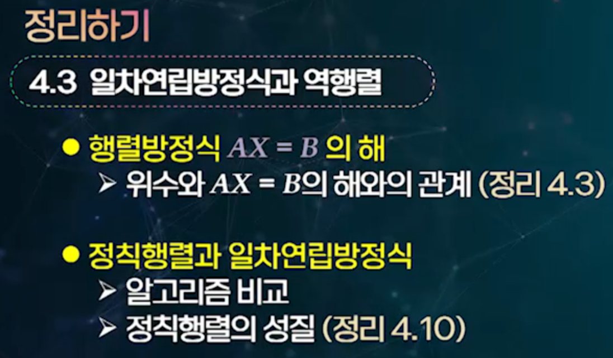
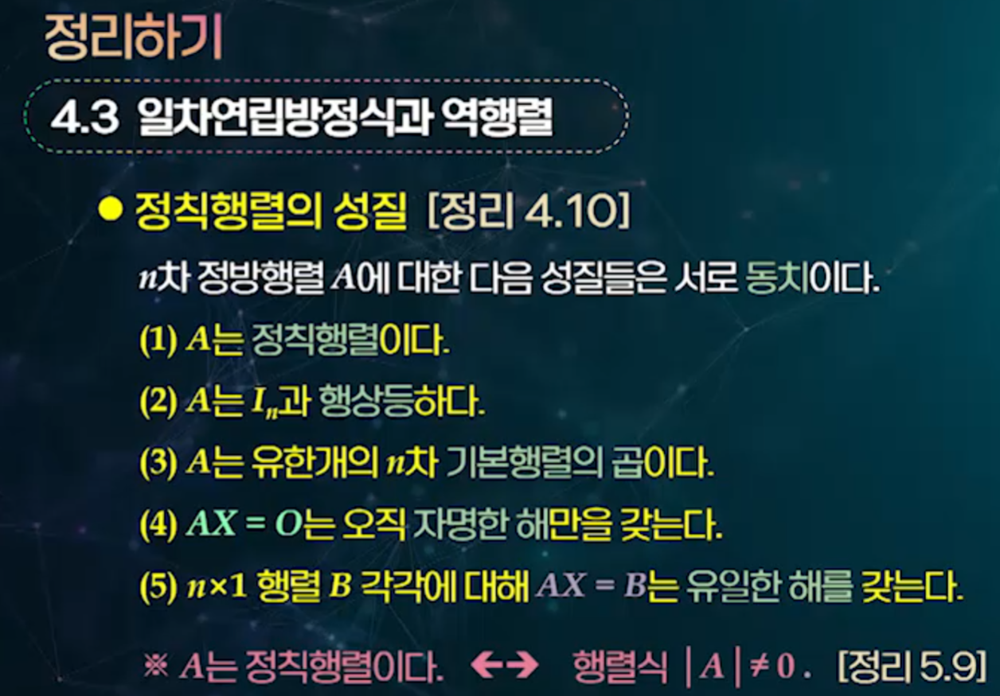

# 4강 역행렬

## 1. 정칙행렬과 역행렬의 정의

### 1.1. 역행렬(Inverse Matrix)의 정의

**n차 정방행렬** A에 대해 행렬 B가 존재하여 다음을 만족할 때:
$$AB = BA = I_n$$

행렬 B를 A의 **역행렬(inverse matrix)**이라 하고 $A^{-1}$로 표기한다.

**핵심 개념**:
1.  **정칙행렬(nonsingular matrix)** 또는 **가역행렬(invertible matrix)**: 역행렬이 존재하는 행렬
2.  **특이행렬(singular matrix)**: 역행렬이 존재하지 않는 행렬
3.  **유일성**: 역행렬이 존재하면 유일하다

**예시**:
$A = \begin{pmatrix} 1 & 2 \\ 1 & 3 \end{pmatrix}$, $B = \begin{pmatrix} 3 & -2 \\ -1 & 1 \end{pmatrix}$

**검증**: 
$$AB = \begin{pmatrix} 1 & 2 \\ 1 & 3 \end{pmatrix}\begin{pmatrix} 3 & -2 \\ -1 & 1 \end{pmatrix} = \begin{pmatrix} 1 & 0 \\ 0 & 1 \end{pmatrix} = I_2$$
$$BA = \begin{pmatrix} 3 & -2 \\ -1 & 1 \end{pmatrix}\begin{pmatrix} 1 & 2 \\ 1 & 3 \end{pmatrix} = \begin{pmatrix} 1 & 0 \\ 0 & 1 \end{pmatrix} = I_2$$

 
  

따라서 A는 정칙행렬이고 B는 A의 역행렬이다.

### 1.2. 역행렬의 유일성

**정리**: A의 역행렬을 B와 C, 즉 2개가 있다고 가정하면:
- $AB = BA = I$
- $AC = CA = I$

그러면:
$$B = BI = B(AC) = (BA)C = IC = C$$

따라서 B와 C는 같을 수밖에 없다. 즉, 역행렬은 유일하다.

**정리 4.1**: A가 정칙행렬이면 $A^{-1}$은 유일하다.

---

## 2. 2×2 행렬의 역행렬

### 2.1. 2×2 행렬의 역행렬 공식

2차 정방행렬 $A = \begin{pmatrix} a & b \\ c & d \end{pmatrix}$에 대해, $D = ad - bc \neq 0$일 때:

$$A^{-1} = \frac{1}{D}\begin{pmatrix} d & -b \\ -c & a \end{pmatrix}$$

<strong>역행렬 공식 유도 과정</strong>

2차 정방행렬 $A = \begin{pmatrix} a & b \\ c & d \end{pmatrix}$의 역행렬 $A^{-1} = \begin{pmatrix} x & y \\ z & w \end{pmatrix}$을 구하는 두 가지 방법을 살펴보자.

#### **방법 1: 크래머 공식을 이용한 증명**

$AA^{-1} = I$로부터 다음 조건을 얻는다:
$$\begin{pmatrix} a & b \\ c & d \end{pmatrix}\begin{pmatrix} x & y \\ z & w \end{pmatrix} = \begin{pmatrix} 1 & 0 \\ 0 & 1 \end{pmatrix}$$

**단계 1**: 행렬 곱셈의 각 성분을 단위행렬과 같다고 놓으면:
- $(1,1)$ 성분: $ax + bz = 1$
- $(1,2)$ 성분: $ay + bw = 0$  
- $(2,1)$ 성분: $cx + dz = 0$
- $(2,2)$ 성분: $cy + dw = 1$

**단계 2**: 이를 두 개의 연립방정식으로 정리하면:

**첫 번째 연립방정식** (x, z에 대해):
$$\begin{cases}
ax + bz = 1 \\
cx + dz = 0
\end{cases}$$

**두 번째 연립방정식** (y, w에 대해):
$$\begin{cases}
ay + bw = 0 \\
cy + dw = 1
\end{cases}$$

**단계 3**: 크래머 공식을 사용하여 해를 구한다.

공통 행렬식: $D = \begin{vmatrix} a & b \\ c & d \end{vmatrix} = ad - bc$

**중요**: 여기서 $D = ad - bc \neq 0$이어야 역행렬이 존재한다.

**이유**: 연립방정식에서 크래머 공식에 의해 해는 $x = \frac{D_x}{D}$, $z = \frac{D_z}{D}$ 형태가 된다. 만약 $D = 0$이면:
- 분모가 0이 되어 해가 정의되지 않거나
- 계수행렬의 두 행이 비례관계에 있어서 연립방정식이 모순이거나 해가 무수히 많아진다

따라서 유일한 해 $A^{-1}$이 존재하려면 반드시 $D = ad - bc \neq 0$이어야 한다.

**첫 번째 연립방정식의 해**:
$$x = \frac{\begin{vmatrix} 1 & b \\ 0 & d \end{vmatrix}}{D} = \frac{1 \cdot d - b \cdot 0}{D} = \frac{d}{D}$$

$$z = \frac{\begin{vmatrix} a & 1 \\ c & 0 \end{vmatrix}}{D} = \frac{a \cdot 0 - 1 \cdot c}{D} = \frac{-c}{D}$$

**두 번째 연립방정식의 해**:
$$y = \frac{\begin{vmatrix} 0 & b \\ 1 & d \end{vmatrix}}{D} = \frac{0 \cdot d - b \cdot 1}{D} = \frac{-b}{D}$$

$$w = \frac{\begin{vmatrix} a & 0 \\ c & 1 \end{vmatrix}}{D} = \frac{a \cdot 1 - 0 \cdot c}{D} = \frac{a}{D}$$

**단계 4**: 최종 역행렬 공식을 얻는다:
$$A^{-1} = \begin{pmatrix} x & y \\ z & w \end{pmatrix} = \begin{pmatrix} \frac{d}{D} & \frac{-b}{D} \\ \frac{-c}{D} & \frac{a}{D} \end{pmatrix} = \frac{1}{D}\begin{pmatrix} d & -b \\ -c & a \end{pmatrix}$$

---

#### **방법 2: 연립방정식 소거법을 이용한 증명**

같은 연립방정식을 소거법으로 직접 풀어보자.

**첫 번째 연립방정식** (x, z에 대해):
$$\begin{cases}
ax + bz = 1 \quad \cdots (1) \\
cx + dz = 0 \quad \cdots (2)
\end{cases}$$

**단계 1**: z를 소거하기 위해 식 (1)에 d를, 식 (2)에 -b를 곱한다:
$$\begin{cases}
adx + bdz = d \quad \cdots (1') \\
-bcx - bdz = 0 \quad \cdots (2')
\end{cases}$$

**단계 2**: (1') + (2')를 계산하면:
$$(ad - bc)x = d$$
$$x = \frac{d}{ad - bc} = \frac{d}{D}$$

**단계 3**: x를 소거하기 위해 식 (1)에 -c를, 식 (2)에 a를 곱한다:
$$\begin{cases}
-acx - bcz = -c \quad \cdots (1'') \\
acx + adz = 0 \quad \cdots (2'')
\end{cases}$$

**단계 4**: (1'') + (2'')를 계산하면:
$$(ad - bc)z = -c$$
$$z = \frac{-c}{ad - bc} = \frac{-c}{D}$$

**두 번째 연립방정식** (y, w에 대해):
$$\begin{cases}
ay + bw = 0 \quad \cdots (3) \\
cy + dw = 1 \quad \cdots (4)
\end{cases}$$

**단계 5**: w를 소거하기 위해 식 (3)에 d를, 식 (4)에 -b를 곱한다:
$$\begin{cases}
ady + bdw = 0 \quad \cdots (3') \\
-bcy - bdw = -b \quad \cdots (4')
\end{cases}$$

**단계 6**: (3') + (4')를 계산하면:
$$(ad - bc)y = -b$$
$$y = \frac{-b}{ad - bc} = \frac{-b}{D}$$

**단계 7**: y를 소거하기 위해 식 (3)에 -c를, 식 (4)에 a를 곱한다:
$$\begin{cases}
-acy - bcw = 0 \quad \cdots (3'') \\
acy + adw = a \quad \cdots (4'')
\end{cases}$$

**단계 8**: (3'') + (4'')를 계산하면:
$$(ad - bc)w = a$$
$$w = \frac{a}{ad - bc} = \frac{a}{D}$$

**중요**: 모든 단계에서 $D = ad - bc \neq 0$이어야 한다. 만약 $D = 0$이면 위의 나눗셈이 불가능하여 해가 존재하지 않거나 무수히 많아진다.

**결론**: 소거법을 통해서도 같은 결과를 얻는다:
$$A^{-1} = \begin{pmatrix} \frac{d}{D} & \frac{-b}{D} \\ \frac{-c}{D} & \frac{a}{D} \end{pmatrix} = \frac{1}{D}\begin{pmatrix} d & -b \\ -c & a \end{pmatrix}, \quad D = ad - bc \neq 0$$

### 2.2. 계산 예시

**예시 1**: $A = \begin{pmatrix} 2 & 1 \\ 5 & 3 \end{pmatrix}$

$D = 2 \times 3 - 1 \times 5 = 6 - 5 = 1$이므로:
$$A^{-1} = \begin{pmatrix} 3 & -1 \\ -5 & 2 \end{pmatrix}$$

**예시 2**: $B = \begin{pmatrix} 5 & 3 \\ 7 & 4 \end{pmatrix}$

$D = 5 \times 4 - 3 \times 7 = 20 - 21 = -1$이므로:
$$B^{-1} = \begin{pmatrix} -4 & 3 \\ 7 & -5 \end{pmatrix}$$

**예시 3**: $C = \begin{pmatrix} 1 & 2 \\ 3 & 4 \end{pmatrix}$

$D = 1 \times 4 - 2 \times 3 = 4 - 6 = -2$이므로:
$$C^{-1} = \frac{1}{-2}\begin{pmatrix} 4 & -2 \\ -3 & 1 \end{pmatrix} = \begin{pmatrix} -2 & 1 \\ \frac{3}{2} & -\frac{1}{2} \end{pmatrix}$$

한편, 정칙행렬 A에 관해 임의의 자연수 n에 대해 $A^{-n} = (A^{-1})^n$으로 정의한다면 3장에서 정의한 거듭제곱을 정칙행렬에 관해 확장할 수 있다. 즉, 임의의 정수 r, s에 대해 다음이 성립한다:

$$A^r A^s = A^{r+s}, (A^r)^s = A^{rs}$$

---

## 3. 역행렬의 성질

### 3.1. 기본 성질들

**정리 4.2**: A, B가 n차 정칙행렬이면 다음이 성립한다.

1.  $(A^{-1})^{-1} = A$
2.  $(AB)^{-1} = B^{-1}A^{-1}$ (**순서 주의**)
3.  $(cA)^{-1} = \frac{1}{c}A^{-1}$ (c가 0이 아닌 상수일 때)
4.  $(A^T)^{-1} = (A^{-1})^T$

### 3.2. 성질 증명 예시

**$(AB)^{-1} = B^{-1}A^{-1}$ 증명**:

$(AB)(B^{-1}A^{-1})$을 계산해보자:
$$(AB)(B^{-1}A^{-1}) = A(BB^{-1})A^{-1} = AIA^{-1} = AA^{-1} = I$$

마찬가지로:
$$(B^{-1}A^{-1})(AB) = B^{-1}(A^{-1}A)B = B^{-1}IB = B^{-1}B = I$$

따라서 $B^{-1}A^{-1}$은 $AB$의 역행렬이다.

### 3.3. m개의 n차 정칙행렬에 대한 일반화

**따름정리**: $A_1, A_2, \cdots, A_m$을 m개의 n차 정칙행렬이라 하면 다음이 성립한다.

$$(A_1 A_2 \cdots A_m)^{-1} = A_m^{-1} A_{m-1}^{-1} \cdots A_2^{-1} A_1^{-1}$$

즉, m개의 n차 정칙행렬을 차례로 곱해서 만들어진 행렬의 역행렬은 각 행렬의 역행렬을 역순으로 곱한 것과 같다.

### 3.4. 행렬 덧셈에 대한 역행렬의 비성립

행렬의 곱셈과 달리 **행렬의 덧셈에 대해서는 역행렬 공식이 성립하지 않는다**.

**중요한 사실**: 일반적으로 $(A + B)^{-1} \neq A^{-1} + B^{-1}$이다.

**이론적 설명**:
행렬의 곱셈은 결합법칙이 성립하여 $(AB)C = A(BC)$이므로 $(AB)^{-1} = B^{-1}A^{-1}$와 같은 공식이 가능하지만, 행렬의 덧셈과 역행렬 연산 사이에는 이와 같은 분배법칙이 성립하지 않는다. 이는 역행렬의 정의 자체가 곱셈에 기반하기 때문이다.

<strong>반례를 통한 증명</strong>

$A = \begin{pmatrix} 1 & 0 \\ 0 & 1 \end{pmatrix} = I_2$, $B = \begin{pmatrix} 1 & 1 \\ 0 & 1 \end{pmatrix}$라 하자.

**단계 1**: 각 행렬의 역행렬을 구한다.
- $A^{-1} = I_2 = \begin{pmatrix} 1 & 0 \\ 0 & 1 \end{pmatrix}$
- $B^{-1} = \begin{pmatrix} 1 & -1 \\ 0 & 1 \end{pmatrix}$ (∵ $\det(B) = 1 \neq 0$)

**단계 2**: $A + B$와 그 역행렬을 구한다.
$$A + B = \begin{pmatrix} 2 & 1 \\ 0 & 2 \end{pmatrix}$$

$\det(A + B) = 2 \times 2 - 1 \times 0 = 4 \neq 0$이므로:
$$(A + B)^{-1} = \frac{1}{4}\begin{pmatrix} 2 & -1 \\ 0 & 2 \end{pmatrix} = \begin{pmatrix} \frac{1}{2} & -\frac{1}{4} \\ 0 & \frac{1}{2} \end{pmatrix}$$

**단계 3**: $A^{-1} + B^{-1}$을 계산한다.
$$A^{-1} + B^{-1} = \begin{pmatrix} 1 & 0 \\ 0 & 1 \end{pmatrix} + \begin{pmatrix} 1 & -1 \\ 0 & 1 \end{pmatrix} = \begin{pmatrix} 2 & -1 \\ 0 & 2 \end{pmatrix}$$

**결론**: 
$$(A + B)^{-1} = \begin{pmatrix} \frac{1}{2} & -\frac{1}{4} \\ 0 & \frac{1}{2} \end{pmatrix} \neq \begin{pmatrix} 2 & -1 \\ 0 & 2 \end{pmatrix} = A^{-1} + B^{-1}$$

따라서 $(A + B)^{-1} \neq A^{-1} + B^{-1}$이 성립한다.

**반례 2**: 
$C = \begin{pmatrix} 2 & 0 \\ 0 & 3 \end{pmatrix}$, $D = \begin{pmatrix} 1 & 2 \\ 3 & 1 \end{pmatrix}$

계산하면:
- $(C + D)^{-1} = \begin{pmatrix} \frac{1}{11} & \frac{2}{11} \\ \frac{3}{11} & -\frac{1}{11} \end{pmatrix}$
- $C^{-1} + D^{-1} = \begin{pmatrix} \frac{3}{10} & \frac{2}{5} \\ \frac{3}{5} & -\frac{1}{10} \end{pmatrix}$

여기서도 $(C + D)^{-1} \neq C^{-1} + D^{-1}$임을 확인할 수 있다.

---

## 4. 역행렬 구하는 방법 (가우스-조던 소거법)

### 4.1. 기본행렬(Elementary Matrix)

**정의 4.2**: n차 단위행렬 $I_n$에 기본행연산을 한 번만 적용하여 얻는 행렬 E를 **기본행렬(elementary matrix)**이라고 한다.

기본행연산이 세 종류가 있으므로 기본행렬도 세 종류가 있다:
- [정의 2.1]에서 정의한 기본행연산 $R_{i,j}$, $R_i(c)$, $R_{i,j}(c)$에 대한 기본행렬을 각각 $E_{i,j}$, $E_i(c)$, $E_{i,j}(c)$로 나타내기로 한다.

**예시 (3×3 기본행렬들)**:
3차 단위행렬 $I_3 = \begin{pmatrix} 1 & 0 & 0 \\ 0 & 1 & 0 \\ 0 & 0 & 1 \end{pmatrix}$에 각각의 기본행연산을 적용하면:

$$E_{1,3} = \begin{pmatrix} 0 & 0 & 1 \\ 0 & 1 & 0 \\ 1 & 0 & 0 \end{pmatrix}, \quad E_2(3) = \begin{pmatrix} 1 & 0 & 0 \\ 0 & 3 & 0 \\ 0 & 0 & 1 \end{pmatrix}, \quad E_{1,3}(2) = \begin{pmatrix} 1 & 0 & 0 \\ 0 & 1 & 0 \\ 2 & 0 & 1 \end{pmatrix}$$

### 4.2. 기본행렬의 성질

**정리 4.3**: A와 B를 n×p 행렬이라 하면 다음이 성립한다.

**(1) A에 기본행연산 R을 적용한 결과는 EA와 같다.**
단, 행렬 E는 n차 단위행렬에 동일한 기본행연산 R을 적용하여 얻은 기본행렬임.

**(2) A와 B가 행상등하다면 유한개의 기본행렬 $E_1, E_2, \cdots, E_k$가 존재하여 다음을 만족한다.**
$$A = E_1E_2 \cdots E_k B$$

**기본행연산과 기본행렬의 대응관계**:
- 기본행연산 $R_{i,j}$ (i행과 j행 교환) ↔ 기본행렬 $E_{i,j}$
- 기본행연산 $R_i(c)$ (i행에 0이 아닌 상수 c 곱하기) ↔ 기본행렬 $E_i(c)$  
- 기본행연산 $R_{i,j}(c)$ (j행에 c를 곱하여 i행에 더하기) ↔ 기본행렬 $E_{i,j}(c)$

**예시 (3×3 기본행렬들)**:
3차 단위행렬 $I_3 = \begin{pmatrix} 1 & 0 & 0 \\ 0 & 1 & 0 \\ 0 & 0 & 1 \end{pmatrix}$에 각각의 기본행연산을 적용하면:

$$E_{1,3} = \begin{pmatrix} 0 & 0 & 1 \\ 0 & 1 & 0 \\ 1 & 0 & 0 \end{pmatrix}, \quad E_2(3) = \begin{pmatrix} 1 & 0 & 0 \\ 0 & 3 & 0 \\ 0 & 0 & 1 \end{pmatrix}, \quad E_{1,3}(2) = \begin{pmatrix} 1 & 0 & 0 \\ 0 & 1 & 0 \\ 2 & 0 & 1 \end{pmatrix}$$

**정리 4.4**: 기본행렬은 정칙행렬이며 그 역행렬은 동일한 종류의 기본행렬이다.

각각에 대해 다음이 성립한다:
1.  $E_{i,j} E_{i,j} = I$, 따라서 $E_{i,j}^{-1} = E_{i,j}$
2.  $E_i(c) E_i(\frac{1}{c}) = I$, 따라서 $E_i(c)^{-1} = E_i(\frac{1}{c})$
3.  $E_{i,j}(c) E_{i,j}(-c) = I$, 따라서 $E_{i,j}(c)^{-1} = E_{i,j}(-c)

<strong>정칙행렬과 영행/영렬의 특성</strong>

n차 정칙행렬 A는 영행이나 영렬을 갖지 않는다.

**예시 1: 영행을 포함하는 행렬 (특이행렬)**
$A = \begin{pmatrix} 1 & 2 \\ 0 & 0 \end{pmatrix}$
행렬 A는 두 번째 행이 모두 0인 영행을 포함한다.
$
det(A) = (1 \times 0) - (2 \times 0) = 0$ 이므로 A는 특이행렬(역행렬이 존재하지 않는 행렬)이다.

**예시 2: 영렬을 포함하는 행렬 (특이행렬)**
$B = \begin{pmatrix} 1 & 0 \\ 2 & 0 \end{pmatrix}$
행렬 B는 두 번째 열이 모두 0인 영렬을 포함한다.
$
det(B) = (1 \times 0) - (0 \times 2) = 0$ 이므로 B는 특이행렬이다.

**예시 3: 영행/영렬이 없는 정칙행렬**
$C = \begin{pmatrix} 1 & 2 \\ 3 & 4 \end{pmatrix}$
행렬 C는 영행이나 영렬을 포함하지 않는다.
$
det(C) = (1 \times 4) - (2 \times 3) = 4 - 6 = -2 \neq 0$ 이므로 C는 정칙행렬이다.

**정리 4.5**: 정칙행렬의 성질은 다음 세 명제가 서로 동치(↔)임을 나타낸다. A는 $n 	imes n$ 행렬이다.
1.  A는 정칙행렬(가역, 역행렬 존재)
2.  A와 $I_n$(단위행렬)은 행상등(row-equivalent)이다.
3.  A는 유한개의 $n 	imes n$ 기본행렬들의 곱으로 쓸 수 있다.

**왜 서로 동치인가? (간단 근거)**
*   **(1 ⇒ 2)**: 가우스 소거로 A를 $I_n$으로 만들 수 있다. 소거의 각 단계는 “왼쪽에서 기본행렬 E를 곱함”과 같으므로, $E_k \cdots E_1 A = I_n$. 즉 A는 $I_n$과 행상등.
*   **(2 ⇒ 3)**: $E_k \cdots E_1 A = I_n$ 이면 $A=(E_k \cdots E_1)^{-1}=E_1^{-1} \cdots E_k^{-1}$. 기본행렬의 역도 기본행렬이므로 A는 기본행렬들의 곱.
*   **(3 ⇒ 1)**: 기본행렬은 모두 가역이고(행교환: 자기자신, 행스케일 $c$: $1/c$, 행덧셈 $+c$: $-c$), 가역행렬의 곱은 가역. 따라서 A도 정칙.

### 4.3. 가우스-조던 소거법을 이용한 역행렬 계산

**알고리즘 4.1**: $A^{-1}$을 구하는 방법

**입력**: n차 정방행렬 A
**출력**: $A^{-1}$의 존재 여부와 존재할 경우 $A^{-1}$

**단계 1**: $n \times 2n$인 확대행렬 $(A|I_n)$을 구성한다.

**단계 2**: 기본행연산을 $(A|I_n)$에 적용하여 소거행제형 행렬 $(B|C)$를 만든다.

**단계 3**: 만일 $B = I_n$이면 $C = A^{-1}$을 출력한다.

만일 $B \neq I_n$이면 B는 영행을 갖게 되므로 A는 정칙행렬이 아니며, 따라서 역행렬 $A^{-1}$이 존재하지 않음을 출력한다.

<strong>그림 설명: 역행렬을 구하는 가우스-조던 소거법 이론</strong>

*   **$(A|I_n)$**: 증강행렬. 왼쪽 블록은 $A$, 오른쪽 블록은 단위행렬 $I_n$. 세로막대 $|$는 “옆에 붙인 블록”이라는 뜻(곱셈 아님).
*   $R_1, R_2, 	..., R_k$: 순서대로 적용하는 기본행연산들(행 교환, 배 곱, 다른 행의 배 더하기).
*   $\longrightarrow (B|C)$: 그 행연산들을 양쪽 블록에 똑같이 적용한 결과가 $(B|C)$라는 뜻.

**동치로 쓰면,**
각 $R_i$에 대응하는 기본행렬을 $E_i$라 할 때 $E = E_k \cdots E_2 E_1$.
그러면 $(B|C) = E (A|I_n) = (EA|EI_n)$,
즉 $B = EA$, $C = E$.

**결과 해석:**
*   $B = I_n$이 되면 $EA = I_n \Rightarrow E = A^{-1}$, 따라서 $C = A^{-1}$.
*   소거 중 $B$에 영행이 생기면 $\text{rank}(A) < n \rightarrow A$는 비가역.

- 다른 예제

### 4.4. 계산 예시

**예제 4.7**: 다음 3차 정방행렬 A, B에 대해서 역행렬이 있으면 구하라.

$A = \begin{pmatrix} 1 & 2 & 3 \\ 3 & 5 & 7 \\ 2 & 6 & 9 \end{pmatrix}$, $B = \begin{pmatrix} 1 & 1 & 1 \\ 2 & 1 & 3 \\ 5 & 3 & 7 \end{pmatrix}$

**(1) 행렬 A에 대해 확대행렬 $(A|I_3)$을 구성한 후 기본행연산을 적용하여 소거행제형으로 변환한다.**

$$(A|I_3) = \begin{pmatrix} 1 & 2 & 3 & 1 & 0 & 0 \\ 3 & 5 & 7 & 0 & 1 & 0 \\ 2 & 6 & 9 & 0 & 0 & 1 \end{pmatrix}$$

$R_{1,2}(-3)$: 
$$\begin{pmatrix} 1 & 2 & 3 & 1 & 0 & 0 \\ 0 & -1 & -2 & -3 & 1 & 0 \\ 2 & 6 & 9 & 0 & 0 & 1 \end{pmatrix}$$

$R_{1,3}(-2)$:
$$\begin{pmatrix} 1 & 2 & 3 & 1 & 0 & 0 \\ 0 & -1 & -2 & -3 & 1 & 0 \\ 0 & 2 & 3 & -2 & 0 & 1 \end{pmatrix}$$

$R_2(-1)$:
$$\begin{pmatrix} 1 & 2 & 3 & 1 & 0 & 0 \\ 0 & 1 & 2 & 3 & -1 & 0 \\ 0 & 2 & 3 & -2 & 0 & 1 \end{pmatrix}$$

계속 소거 과정을 거쳐 최종적으로:
$$\begin{pmatrix} 1 & 0 & 0 & 3 & 0 & -1 \\ 0 & 1 & 0 & -13 & 3 & 2 \\ 0 & 0 & 1 & 8 & -2 & -1 \end{pmatrix} = (I_3|C)$$

$B = I_3$이므로 $A^{-1} = C = \begin{pmatrix} 3 & 0 & -1 \\ -13 & 3 & 2 \\ 8 & -2 & -1 \end{pmatrix}$

---

## 5. 일차연립방정식과 역행렬 (교재 91p)

### 5.1. 일차연립방정식의 해법

제2장에서 일차연립방정식을 행렬방정식 $AX = B$ 형태로 표현하고, 확대행렬 $C = (A|B)$에 적절한 기본행연산을 적용함으로써 해를 구하는 것을 다뤘다.

**일차연립방정식**:
$$\begin{cases}
a_{11}x_1 + a_{12}x_2 + \cdots + a_{1n}x_n = b_1 \\
a_{21}x_1 + a_{22}x_2 + \cdots + a_{2n}x_n = b_2 \\
\vdots \\
a_{m1}x_1 + a_{m2}x_2 + \cdots + a_{mn}x_n = b_n
\end{cases}$$

에 대한 계수행렬을 A, 미지수행렬을 X, 상수행렬을 B라 하면:

$$AX = B$$

- **[정의4.3] 위수** : 행렬 A에 기본행연산을 적용하여 행제형 행렬 B로 만들었을 때 B의 영행이 아닌 행의 수를 행렬 A의 위수(rank)라고 한다.
  - 참조: 93p 예제 4.8

- [정리 4.7] : 방정식이
  𝑚 개이고 미지수가
  𝑛 개인 일차연립방정식을
  𝐴𝑋 = 𝐵와 같이 행렬방정식으로 나타냈을 때 다음이 성립한다.
  - (1) 행렬 𝐴의 위수와 확대행렬 (𝐴 ∣ 𝐵)의 위수가 같기 위한 필요충분조건은 주어진 연립방정식이 해를 갖는 것이다.
  - (2) 행렬 𝐴와 확대행렬 (𝐴 ∣ 𝐵)의 위수가 미지수의 개수 𝑛과 같기 위한 필요충분조건은 주어진 연립방정식이 유일한 해를 갖는 것이다.

### 5.2. 해의 존재 조건

가우스-조던 소거법은 확대행렬 $(A|B)$를 소거행제형 행렬 $(C|D)$로 변환한다.

**해의 존재 조건**:
1.  행렬 $(C|D)$의 어느 행이 $(0 \; 0 \; \cdots \; 0 | k)$ (단, $k \neq 0$) 형태가 있으면 해가 없다.
2.  C에서 영행이 아닌 행의 수를 r(rank, 위수)이라 할 때:
    - $r = n$인 경우: 유일한 해를 갖는다.
    - $r < n$인 경우: 무수히 많은 해를 갖는다 ((n-r)개의 자유변수 존재).

<strong>예시: 해의 존재 및 유일성 판별</strong>

다음 일차연립방정식들을 통해 해의 존재 및 유일성 조건을 확인해 보자.

**1. 해가 없는 경우 (rank(A) ≠ rank(A|B))**
연립방정식:
$x + y = 1$
$x + y = 2$

계수행렬 A: $\begin{pmatrix} 1 & 1 \\ 1 & 1 \end{pmatrix}$
확대행렬 (A|B): $\begin{pmatrix} 1 & 1 & 1 \\ 1 & 1 & 2 \end{pmatrix}$

*   $\text{rank}(A) = 1$
*   $\text{rank}(A|B) = 2$ (두 번째 행에서 첫 번째 행을 빼면 $\begin{pmatrix} 0 & 0 & 1 \end{pmatrix}$이 되므로)

$\text{rank}(A) \neq \text{rank}(A|B)$이므로, 이 연립방정식은 해가 존재하지 않는다.

**2. 유일한 해가 존재하는 경우 (rank(A) = rank(A|B) = n)**
연립방정식:
$x + y = 3$
$x - y = 1$

계수행렬 A: $\begin{pmatrix} 1 & 1 \\ 1 & -1 \end{pmatrix}$
확대행렬 (A|B): $\begin{pmatrix} 1 & 1 & 3 \\ 1 & -1 & 1 \end{pmatrix}$

*   미지수의 개수 $n = 2$
*   $\text{rank}(A) = 2$ (행렬식 $1 \times (-1) - 1 \times 1 = -2 \neq 0$)
*   $\text{rank}(A|B) = 2$ (기본행연산을 통해 좌측을 단위행렬로 만들 수 있다)

$\text{rank}(A) = \text{rank}(A|B) = n = 2$이므로, 이 연립방정식은 유일한 해를 갖는다. (실제 해: $x=2, y=1$)

**3. 무수히 많은 해가 존재하는 경우 (rank(A) = rank(A|B) < n)**
연립방정식:
$x + y + z = 1$
$2x + 2y + 2z = 2$

계수행렬 A: $\begin{pmatrix} 1 & 1 & 1 \\ 2 & 2 & 2 \end{pmatrix}$
확대행렬 (A|B): $\begin{pmatrix} 1 & 1 & 1 & 1 \\ 2 & 2 & 2 & 2 \end{pmatrix}$

*   미지수의 개수 $n = 3$
*   $\text{rank}(A) = 1$ (두 번째 행은 첫 번째 행의 2배이므로 선형 종속)
*   $\text{rank}(A|B) = 1$ (마찬가지로 선형 종속)

$\text{rank}(A) = \text{rank}(A|B) = 1 < n = 3$이므로, 이 연립방정식은 무수히 많은 해를 갖는다. (자유 변수 $3 - 1 = 2$개)

### 5.3. 역행렬을 이용한 해법

**정리 4.8**: A가 n차 정칙행렬이면 임의의 n × 1 행렬 B에 대해 행렬방정식 $AX = B$는 유일한 해 $X = A^{-1}B$를 갖는다.

- ※ $a$ != $0$이면 일차방정식 $ax = b$는 유일한 해 $x = a^{-1}b$를 갖는다.
- ※ [정리 5.9]
  - A는 정칙행렬이다. <=> 행렬식 |A| != 0

**예시**: 
$$\begin{cases} x + 3y = 2 \\ 2x + 6y = 4 \end{cases}$$

주어진 연립방정식은 $x = -1, y = 1$일 때 성립하므로 $Y = (-1, 1)$은 하나의 해이다. 다음으로 동차방정식 $AX = O$는:

$$\begin{cases} x + 3y = 0 \\ 2x + 6y = 0 \end{cases}$$

$y = t$로 치환하면 모든 실수 t에 대하여 $X_0 = (-3t, t)$가 $AX = O$의 해가 된다. [정리 4.11]에 의해 해는 모든 실수 t에 대하여 $X_0 + Y = (-3t, t) + (-1, 1) = (-1 - 3t, 1 + t)$로 표시된다.

---

## 6. 동차연립방정식

### 6.1. 동차연립방정식(Homogeneous Linear System)

동차연립방정식이란 방정식 $AX = B$에서 $B = O$인 경우이다. 동차연립방정식 $AX = O$는 항상 자명한 해 $X = O$를 갖는다.

**정리 4.9**: n차 정방행렬 A가 $I_n$과 행상등하기 위한 필요충분조건은 동차연립방정식 $AX = O$가 오직 자명한 해만 갖는 것이다.

### 6.2. 동차연립방정식의 성질

A가 정방행렬로서 $I_n$과 행상등하고 가정하자. 그러면 방정식 $AX = O$와 $I_n X = O$는 동일한 해를 갖는다. 앞서서 A와 $I_n$이 행상등하면 $(A|O)$와 $(I_n|O)$도 행상등하고 [정리 2.1]에 따라 $AX = O$와 $I_n X = O$는 상등하기 때문이다. $I_n X = O$는 $X = O$만 해로 갖는다. 따라서 $AX = O$도 $X = O$만 해로 갖는다.

반대로 $AX = O$가 오직 $X = O$만 해로 갖는다고 하자. A를 소거행제형으로 바꾼 것이 R이라 하면 $AX = O$와 $RX = O$는 동일한 해를 갖는다.

가정에서 $AX = O$가 오직 $X = O$만 해로 갖았으므로 $RX = O$도 $X = O$만 해로 갖는다. 만일 $R \neq I_n$이라면 R은 영행을 포함하게 되므로 자명하지 않은 해가 존재하게 된다. 이는 모순이므로 $R = I_n$이다. 결국 A는 $I_n$과 행상등하다.

### 6.3. 비동차연립방정식과의 관계

**정리 4.11**: $AX = B$의 한 해를 Y라 하고 $AX = O$의 임의의 해를 $X_0$라 하면, $AX = B$의 모든 해는 $X_0 + Y$로 표시된다.

---

## 7. 정칙행렬의 특성 정리

**정리 4.10**: n차 정방행렬 A에 대한 다음 성질은 서로 동치이다.

1.  A는 정칙행렬이다.
2.  A는 $I_n$과 행상등하다.
3.  A는 유한개의 n차 기본행렬의 곱이다.
4.  $AX = O$는 오직 자명한 해만 갖는다.
5.  임의의 n × 1행렬 B에 대해 $AX = B$는 유일한 해를 갖는다.

**증명의 개요**:
- [정리 4.5]에 의해 (1), (2), (3)은 서로 동치이다. 
- [정리 4.9]에 의해 (1), (2), (3), (4)는 서로 동치이다. 
- [정리 4.8]에 의해 (5)도 동치이다.

---

## 8. 종합 정리

**요약**:

• n차 정방행렬 A에 대해 $AB = BA = I_n$을 만족하는 행렬 B가 존재할 때 A를 정칙행렬이라 하며, B를 A의 역행렬 $A^{-1}$이라 한다.

• A가 정칙행렬이면 $A^{-1}$은 유일하다.

• 임의의 2차 정방행렬 $A = \begin{pmatrix} a & b \\ c & d \end{pmatrix}$의 역행렬은 $D = ad - bc \neq 0$일 때 $A^{-1} = \frac{1}{D}\begin{pmatrix} d & -b \\ -c & a \end{pmatrix}$이다.

• A와 B가 정칙행렬이면 $A^{-1}$, $AB$, $cA$, $A^T$도 정칙행렬이다(c는 0이 아닌 상수). 즉, $(A^{-1})^{-1} = A$, $(AB)^{-1} = B^{-1}A^{-1}$, $(cA)^{-1} = \frac{1}{c}A^{-1}$, $(A^T)^{-1} = (A^{-1})^T$이다.

• 단위행렬에 기본행연산을 한 번만 적용하여 얻는 행렬을 기본행렬이라고 하는데, 기본행연산 $R_{i,j}$, $R_i(c)$, $R_{i,j}(c)$ 각각에 대응하여 기본행렬도 $E_{i,j}$, $E_i(c)$, $E_{i,j}(c)$와 같이 세 종류가 있다.

• 정칙행렬과 단위행렬은 행상등하므로 정칙행렬은 기본행렬의 곱으로 표현된다.

• n차 정방행렬 A에 대해 $A^{-1}$을 구하려면 확대행렬 $(A|I_n)$을 기본행연산으로 $(I_n|A^{-1})$ 형태로 변환한다. 이때 $B = I_n$이면 $A^{-1} = C$이지만 $B \neq I_n$이면 $A^{-1}$은 존재하지 않는다.

• 정칙행렬의 특성을 정리하면 [정리 4.10]과 같다.

• A가 정칙행렬이면 일차연립방정식 $AX = B$는 $X = A^{-1}B$로 해를 구할 수 있으며 $AX = O$는 자명한 해만 갖는다.

