# 제2장 배열 (Array)

## 개관

배열은 자료의 추상화된 의미와 구체화된 의미가 매우 밀접하게 혼재된 자료구조

자료 간의 관계가 추상화되었을 때와 구체화되어 저장되었을 때가 동일함

배열은 자료 간의 순서가 아주 중요함. 배열은 자료값에 해당하는 원소값과 몇 번째에 해당하는지 의미하는 인덱스로 구성됨.
즉, 배열은 순서를 표현하는 인덱스와 값을 표현하는 원소 값의 쌍으로 이뤄짐.

추상화된 배열읭 ㅝㄴ소의 순서는 구체화된 배열이 메인 메모리에 저장될 때에도 같은 순서로 저장됨.

## 학습 목표

1. 배열의 추상 자료형을 이해한다.
2. 배열에서 원소의 순서와 저장 위치에 대해서 이해한다.
3. 1차원 배열이 확장된 2차원 배열의 메인 메모리의 연속 할당을 이해한다.
4. 희소행렬의 구조와 희소행렬을 표현하기 위한 2차원 배열의 장점을 이해한다.

## 용어 정리

- **배열**: 인덱스와 원소값(index, value)의 쌍으로 구성된 집합이며, 정의된 각 인덱스는 그 인덱스와 관련된 값을 정의함
- **2차원 배열**: 원소값을 특정하기 위해 필요한 인덱스가 두 개인 배열
- **행우선 저장 방식**: 하나의 행을 연속적으로 메모리에 할당하는 방법
- **열우선 저장 방식**: 하나의 열을 연속적으로 메모리에 할당하고, 그다음 열을 할당하는 방법
- **희소행렬(sparse matrix)**: 0인 원소보다 0이 아닌 원소가 상대적으로 많은 행렬

---

## 1. 배열의 정의

### 1.1 기본 개념

배열은 "일정한 차례나 간격에 따라 벌여 놓음"으로 정의됨. 
배열은 차례(순서)와 관련된 기본적인 자료 구조

<details>
<summary>아파트 비유를 통한 배열 이해</summary>

아파트 호수 "101호", "201호", "301호", "401호"...와 같이 계속해서 있는 구조처럼, 
배열은 호수(인덱스)와 각 호수의 영역(메모리 영역, 원소값을 위한 저장소)으로 구성됨.

</details>

### 1.2 배열의 특징

- 배열의 순서는 메모리 공간에서 저장되는 '원소값의 물리적 순서'

1. **인덱스와 원소값의 쌍**: (index, value) 형태로 구성
2. **동일한 자료형**: 모든 원소가 같은 data type을 가짐
3. **물리적 연속성**: 메모리 주소의 순서(물리적 위치)와 배열의 논리적 순서(추상화된 인덱스의 순서)가 일치
4. **직접 접근**: 배열의 첫 번째 원소가 위치하는 메모리 주소를 알면 인덱스 값을 이용하여 배열의 원소값에 직접 접근 가능

### 1.3 물리적 저장과 추상적 인덱스

- **물리적 순서**: 메모리 주소값(16진수)으로 결정됨
- **추상적 순서**: 프로그래머가 인식하기 쉬운 간단한 숫자(0, 1, 2, ...)

1. 배열의 물리적인 저장 순서는 배열의 인덱스에 의해서 결정되며, 그 순서가 바로 메인 메모리에서 저장 위치의 순서가 됨
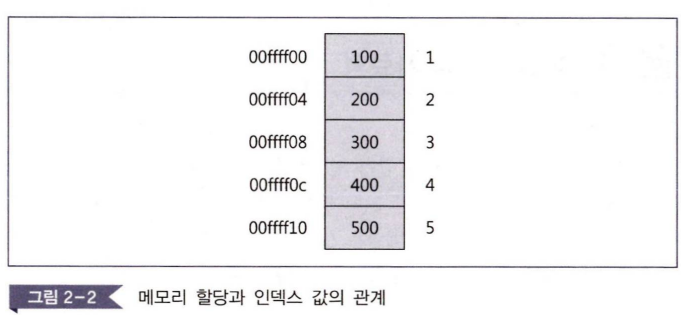
2. 메모리 영역의 추상화와 구체화 
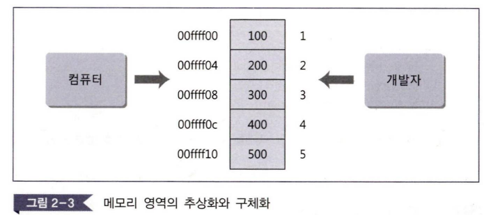
- 컴퓨터 : 운영체제 컨트롤 아래 메모리 물리적 주소값을 전달받아 자료 가져옴
- CPU : 가져온 자료 계산
- 개발자 : 프로그램에서 선언한 배열과 인덱스 값을 이용하여 알고리즘을 작성하고 그 알고리즘에 따라 프로그램 완성
- 운영체제 : 개발자의 추상화된 값과 컴퓨터의 물리적 값을 연결
- 프로그래밍 언어 : 개발자와 운영체제 간의 의사소통을 위한 도구

<details>
<summary>메모리 주소와 인덱스의 관계</summary>

```
메모리 주소    |  배열값  |  인덱스
-------------|---------|--------
00ffff00     |   100   |   1
00ffff04     |   200   |   2  
00ffff08     |   300   |   3
00ffff0c     |   400   |   4
00ffff10     |   500   |   5
```

</details>

---

## 2. 배열의 추상 자료형

### 2.1 ADT 정의

```
ADT Array
• 배열 객체: (i∈Index, e∈Element) 쌍들의 집합, Index는 순서를 나타내는 정수값이고 Element는 원소값
• 연산: a∈Array; i∈Index; x, item∈Element; n∈Integer인 모든 a, item, n에 대해
  (같은 크기와 같은 연산이 정의됨, a는 0개 이상의 원소를 갖는 배열, item은 배열의 원소, n은 배열의 최대 크기)

① Array create(n) ::= n개의 크기를 갖는 생성하고 공백 배열을 반환함;
② Element retrieve(a, i) ::= if(i∈Index)
    then { 배열의 a의 i 번째에 있는 'e'를 반환함; }
    else { 에러 메시지를 반환함; }
③ Array store(a, i, e) ::= if(i∈Index)
    then { a의 i 위치에 'e'를 저장하여 배열 a를 반환함; }
    else { 인덱스 i가 배열 a에 없다는 에러 메시지를 반환함; }
End Array
```

## 3 배열 연산의 구현 

### 3.1. create(n) 연산
- n개의 원소들을 저장할 수 있는 공백 배열(empty array) 생성
- 배열 안에 원소값들이 아직 채워지지 않은 것을 의미

**예시 코드**:
```c
void create(int n) {    // n=5
    int a[n];
    int i;
    for(i=0; i<n; i++) {
        a[i] = 0;
    }
}
```

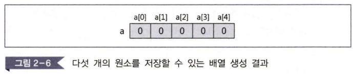

### 3.2. 배열값의 검색 retrieve(a, i) 연산
- 배열 a와 인덱스 i를 매개변수로 전달받아 인덱스 i 위치에 대응되는 원소값 e가 있다면 원소값 e를 반환

**예시 코드**:
```c
#define array_size 5
int retrieve(int *a, int i) {    // i = 2
    if(i >= 0 && i < array_size) 
        return a[i];
    else { 
        printf("Error\n");
        return(-1); 
    }
}
```

### 3.3. 배열값의 저장 store(a, i, e) 연산
- 배열 a와 인덱스 i, 원소값 e를 매개변수로 전달받아 인덱스가 검사하여 i 값이 유효할 경우 <i, e> 쌍이 되게 원소값을 i 번째 인덱스에 저장

**예시 코드**:
```c
#define array_size 5
void store(int *a, int i, int e) {    // i=3, e=35
    if(i >= 0 && i < array_size)
        a[i] = e;
    else 
        printf("Error\n");
}
```

---

## 4. 1차원 배열

### 4.1 메모리 연속 할당

1차원 배열의 원소들은 컴퓨터 메모리의 연속적인 기억장소에 한정되어 순차적으로 저장됨.


### 4.2 주소 계산 공식

배열 A의 i번째 원소 A[i]가 저장된 메모리 주소:

**A[i]의 주소 = α + i × k**

- α: 배열의 시작 주소
- i: 인덱스
- k: 각 원소의 크기

<details>
<summary>1차원 배열 메모리 할당 예시</summary>

```
A[0]  →  α
A[1]  →  α+k
A[i]  →  α+i×k
A[u]  →  α+u×k
```

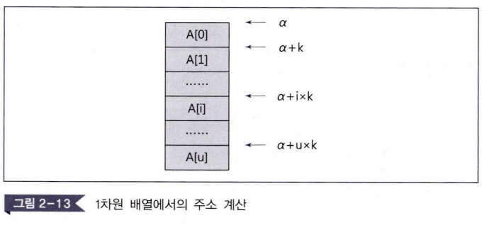

</details>

---

## 5. 배열의 확장

### 5.1 2차원 배열의 개념

1차원 배열을 확장 => 2차원 배열은 여러 개의 1차원 배열을 쌓아 놓은 것으로 생각할 수 있음.

### 5.2 2차원 배열의 메모리 할당 방식

#### 5.2.1 행우선 저장 방식 (Row-major Order)
- 하나의 행이 모두 연속적으로 메모리에 할당됨
- 그다음 행이 메모리 영역에 할당됨
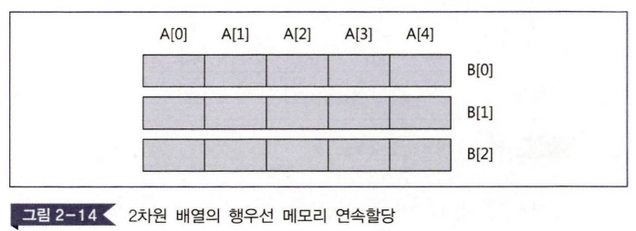

#### 5.2.2 열우선 저장 방식 (Column-major Order)  
- 하나의 열이 모두 연속적으로 메모리에 할당됨
- 그다음 열이 메모리 영역에 할당됨
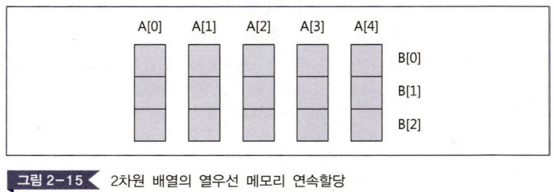

#### 5.2.3 행렬과 배열
- 행렬을 컴퓨터에서 표현하기에 2차원 배열이 적합함
- 네트워크의 시뮬레이션, 최단거리 계산 등에서 사용됨

- **다차원 배열** : 하나의 원소는 두 개의 첨자 i와 j의 쌍으로 구분되며, 두 개 이상의 첨자가 필요한 배열을 총칭
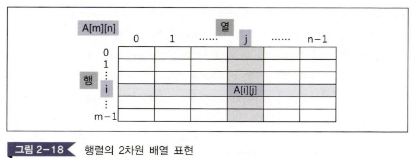

### 5.3. 배열과 메모리 할당

#### 5.3.1. 행우선 메모리 할당
- 행(row)우선 메모리 할당 : 하나의 행을 연속적으로 메모리에 할당하고, 그다음 행을 메모리 영역에 할당
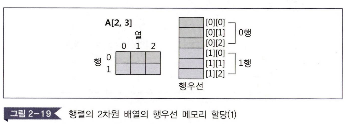

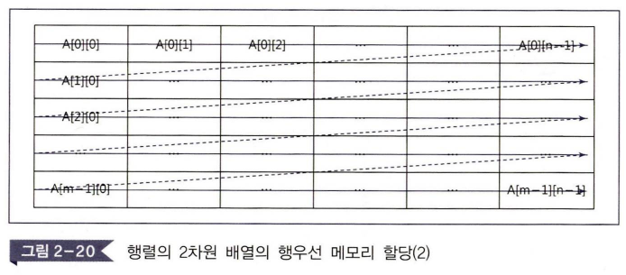

#### 5.3.2. 열우선 메모리 할당
- 열(column)우선 메모리 할당 : 하나의 열을 연속적으로 메모리에 할당하고, 그다음 열을 메모리 영역에 할당
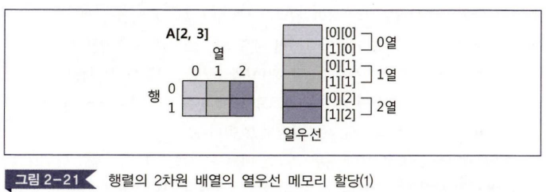
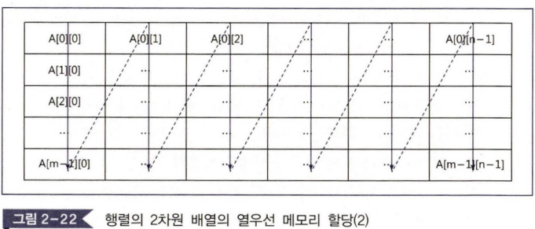

#### 5.3.3. 2차원 배열 특징
- '메모리에서 물리적인 저장 순서와 프로그래머의 추상적인 순서가 일치한다'는 배열의 성질이 2차원 배열에서도 여전히 지켜지고 있음.
- 행우선 프로그래밍 언어 : COBOL, Pascal, C
- 열우선 프로그래밍 언어 : FORTRAN

### 5.4 C언어에서의 2차원 배열

C언어는 행우선 순서를 따름. 배열 A[3][5]의 경우:

```
0,0 → 0,1 → 0,2 → 0,3 → 0,4
1,0 → 1,1 → 1,2 → 1,3 → 1,4  
2,0 → 2,1 → 2,2 → 2,3 → 2,4
```

---

## 6. 희소행렬의 개념

### 6.1 희소행렬이란?

**희소행렬(Sparse Matrix)**: 원소값이 0인 원소가 그렇지 않은 원소보다 상대적으로 많은 행렬
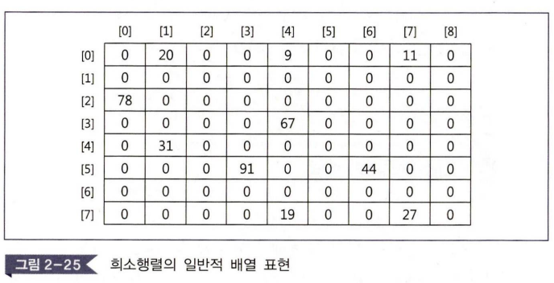

### 6.2 희소행렬 표현의 필요성

일반적인 2차원 배열로 희소행렬을 표현할 경우:
- 많은 0값으로 인한 메모리 낭비 발생
- 0이 아닌 값만을 효율적으로 저장할 필요

### 6.3 희소행렬의 효율적 표현

#### 방법 1: 3열 배열을 이용한 표현

| 행 | 열 | 값 |
|---|---|---|
| 0 | 1 | 20 |
| 0 | 4 | 9 |
| 0 | 7 | 11 |
| 2 | 0 | 78 |
| 3 | 4 | 67 |
| 4 | 1 | 31 |
| 5 | 3 | 91 |
| 5 | 6 | 44 |
| 7 | 4 | 19 |
| 7 | 7 | 27 |

**장점**:
- 메모리 사용량 크게 감소
- 0이 아닌 값들만 저장하여 효율성 증대
- 행, 열, 값의 정보를 명확히 관리

---

## Summary | 요약

1. **배열**: 인덱스와 원소값(index, value)의 쌍으로 구성된 집합이며, 정의된 각 인덱스는 그 인덱스와 관련된 값을 갖음

2. **배열의 순서**: 메모리 공간에서 저장되는 "원소값의 물리적 순서"를 의미함

3. **배열의 위치**: 각 원소의 물리적인 위치(메모리 주소)의 순서는 배열의 인덱스의 순서(논리적인 순서)와 일치함

4. **직접 접근(direct access)**: 배열의 인덱스 값을 이용해서 배열의 원소값에 접근하는 것

5. **배열의 물리적인 저장 순서**: 배열의 인덱스에 의해서 결정되며, 그 순서가 바로 메인 메모리에서의 저장 위치의 순서가 됨

6. **create(n)**: n개의 원소들을 저장할 수 있는 공백 배열(empty array)을 생성함. 배열을 생성할 때 n개의 원소들을 저장할 수 있는 공간은 만들어지지만 그 안에 채워진 원소값들이 아직은 없다는 것을 의미함

7. **연산 retrieve(a, i)**: 배열 a와 인덱스 i를 매개변수로 전달받아 인덱스 i 위치에 대응되는 원소값 e가 있다면 원소값 e를 반환하고 그렇지 않은 경우 에러 메시지를 반환함

8. **연산 store(a, i, e)**: 배열 a와 인덱스 i, 원소값 e를 매개변수로 전달받아 인덱스를 검사하여 i 값이 유효할 경우 <i, e> 쌍이 되게 원소값을 i 번째 인덱스에 저장하고 배열 a를 반환함

9. **가장 기본적인 배열**: 1차원 배열이며, 한 줄짜리 배열을 의미하므로 인덱스는 하나임. 한 줄짜리 배열은 메모리 영역도 한 줄로 할당받음

10. **2차원 배열의 행우선 저장 방식**: 하나의 행이 모두 연속적으로 메모리 영역을 할당받고, 다음 행이 메모리 영역을 연속적으로 할당받는 방식임

11. **2차원 배열의 열우선 저장 방식**: 하나의 열이 모두 연속적으로 메모리 영역을 할당받고, 다음 열이 메모리 영역을 연속적으로 할당받는 방식임

12. **원소값이 0인 원소가 그렇지 않은 원소보다 상대적으로 많은 행렬**: 희소행렬(sparse matrix)이라고 함
