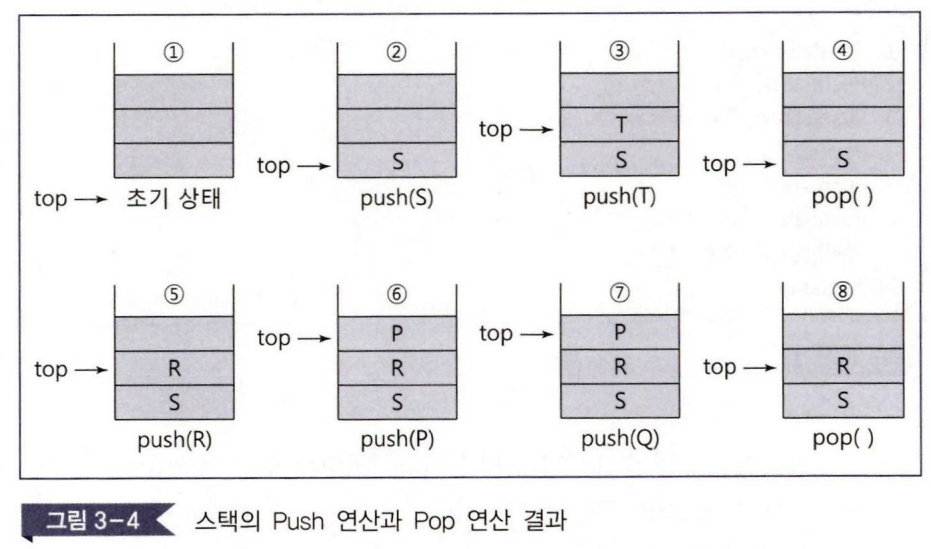
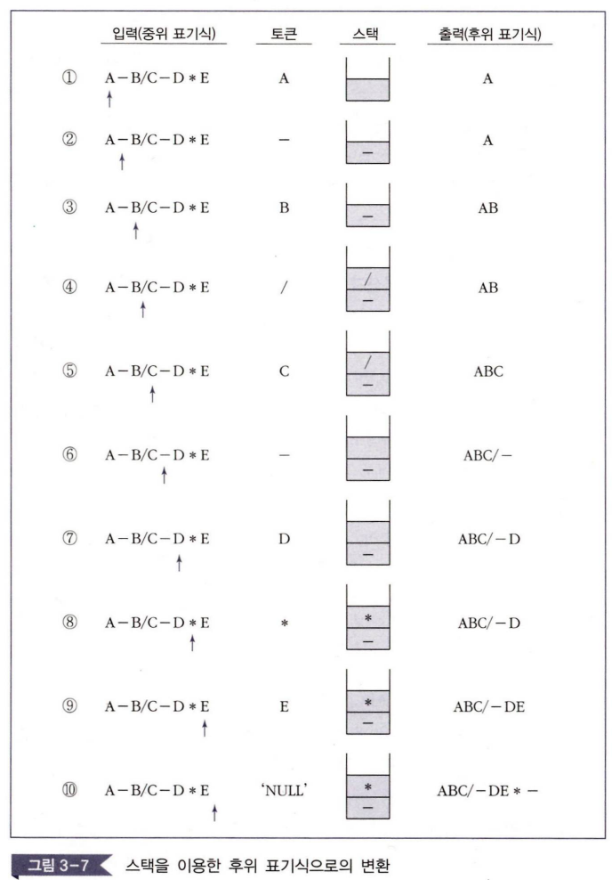

# 3. 스택

## 개관

스택은 입출력의 순서가 정해진 자료구조. 특히, 나중에 들어간 것이 먼저 나오는 LIFO(Last In First Out) 특성을 가짐. 미로찾기, 깊이 우선 탐색, 사칙연산식의 계산 등에서 우선순위를 고려한 처리에 활용됨.

## 학습 목표

1. 스택의 추상 자료형을 이해한다.
2. 스택의 삽입 연산과 삭제 연산에 대해서 이해한다.
3. 스택을 이용한 사칙연산의 계산 방법을 이해한다.
4. 사칙연산의 전위 표기법, 후위 표기법, 중위 표기법을 이해한다.

## 용어 정리

- **스택(stack)**: 객체와 그 객체가 저장되는 순서를 기억하는 방법에 관한 추상 자료형
- **시스템 스택(system stack)**: 변수에 대한 메모리의 할당과 수집을 위해 운영체제가 관리하는 스택
- **스택의 삭제 연산**: 스택의 가장 위에 있는 원소를 삭제하는 연산
- **스택의 삽입 연산**: 스택의 가장 위에 있는 원소 위에 원소를 추가하는 연산
- **중위 표기법(infix notation)**: 연산자를 피연산자의 사이에 표기하는 방법 (A+B)
- **전위 표기법(prefix notation)**: 연산자를 피연산자의 앞에 표기하는 방법 (+AB)
- **후위 표기법(postfix notation)**: 연산자를 피연산자의 뒤에 표기하는 방법 (AB+)

---

## 1. 스택의 개념

### 스택의 특징
1. **LIFO(Last In First Out) 구조**: 마지막에 입력된 자료가 가장 먼저 출력
2. **한쪽 끝에서만 삽입/삭제**: top에서만 연산이 이루어짐
3. **순차적 접근**: 중간 위치의 자료에 직접 접근 불가능

- 스택의 크기는 무한하지 않음.
  - 스택에 원소를 넣을 때 스택이 꽉 찼는지 검사해야 함
  - 원소를 뺄 때 뺄 원소가 있는지 검사해야 함 

### 스택의 기본 연산
- **push(add)**: 스택의 top에 원소를 삽입하는 연산
- **pop(delete)**: 스택의 top에서 원소를 삭제하고 반환하는 연산
- **top 포인터**: 스택의 가장 위에 있는 원소의 위치를 가리킴

<details>
<summary>스택 개념 예시</summary>

벽돌을 쌓는 것과 같은 개념:
- 벽돌을 위에서부터 쌓음 (push 연산)
- 벽돌을 위에서부터 제거 (pop 연산)
- 가장 마지막에 놓인 벽돌이 가장 먼저 제거됨
</details>

---

## 2. 스택의 추상 자료형

### 스택 ADT 정의

**객체**: 0개 이상의 원소를 갖는 순서 리스트

**연산**:
- `Stack CreateStack(maxStackSize)`: 크기가 maxStackSize인 빈 스택을 생성하고 반환
- `Boolean StackIsFull(stack, maxStackSize)`: 스택이 가득 찼는지 확인
- `Stack Push(stack, item)`: 스택이 가득 찬 상태가 아니면 item을 삽입
- `Boolean StackIsEmpty(stack)`: 스택이 빈 상태인지 확인  
- `Element Pop(stack)`: 스택이 빈 상태가 아니면 top의 원소를 삭제하고 반환



### 추상 자료형 세부 정의

스택의 추상 자료형에서 정의된 연산은 시스템 개발자에 따라 다르게 정의되고 구현될 수도 있고, 컴파일러의 설계자에 따라 프로그래밍 언어에서 다르게 제공될 수도 있음.

```
Stack CreateStack(maxStackSize) ::=
    스택의 크기가 maxStackSize인 빈 스택을 생성하고 반환한다;

Boolean StackIsFull(stack, maxStackSize) ::=
    if((stack의 elements의 개수) == maxStackSize)
        then { 'TRUE' 값을 반환한다; }
        else { 'FALSE' 값을 반환한다; }

Stack Push(stack, item) ::=
    if (StackIsFull(stack))
        then { 'stackFull'을 출력한다; }
        else { 스택의 가장 위에 item을 삽입하고, 스택을 반환한다; }

Boolean StackIsEmpty(stack) ::=
    if(stack == CreateStack(maxStackSize))
        then { 'TRUE' 값을 반환한다; }
        else { 'FALSE' 값을 반환한다; }

Element Pop(stack) ::=
    if(StackIsEmpty(stack))
        then { 'stackEmpty'를 출력한다; }
        else { 스택의 가장 위에 있는 원소(element)를 삭제하고 반환한다; }
```

---

## 3. 스택의 응용

### 주요 응용 분야

1. **메모리 관리**: 시스템 스택을 통한 변수의 생명주기 관리
2. **서브루틴 호출**: 함수 호출 시 복귀 주소 저장
3. **후위 수식 계산**: 연산자 우선순위 처리
4. **인터럽트 처리**: 인터럽트 처리가 끝난 후 되돌아갈 명령 수행 지점 저장
5. **문법 검사**: 괄호의 올바른 짝 확인
6. **컴파일러**: 구문 분석 및 코드 생성
7. **순환 호출**: 재귀 함수의 실행 순서 관리

---

## 4. 스택의 연산

### 4.1. 스택의 삭제 연산 (pop)

```c
int pop() {
    if (top == -1)
        return StackEmpty();
    else 
        return stack[top--];
}
```

#### 특징
1. `top == -1`이면 빈 스택 상태 (stackEmpty 반환)
2. 스택에 원소가 있으면 `stack[top]` 값을 반환하고 `top`을 1 감소
3. `top--` 연산자: 현재 top 값을 반환 후 1 감소

### 4.2. 스택의 삽입 연산 (push)

```c
void push(int item) {
    if (top >= STACK_SIZE-1)
        return StackIsFull();
    else 
        stack[++top] = item;
}
```

#### 특징
1. `top >= STACK_SIZE-1`이면 스택이 가득 찬 상태 (stackFull 반환)
2. 공간이 있으면 `top`을 1 증가시킨 후 `item` 저장
3. `++top` 연산자: top을 1 증가시킨 후 그 값을 사용

---

## 5. 사칙연산식의 전위 · 후위 · 중위 표현

### 표기법의 종류

① **중위 표기법(infix notation)**: 연산자를 피연산자의 사이에 표기하는 방법이며 일반적으로 가장 많이 사용되는 표기 방법 → A + B

② **전위 표기법(prefix notation)**: 연산자를 피연산자의 앞에 표기하는 방법 → +AB

③ **후위 표기법(postfix notation)**: 연산자를 피연산자의 뒤에 표기하는 방법 → AB+

### 연산자 우선순위와 계산 순서

#### 연산자 우선순위 (높은 순)
1. `*`, `/` (곱셈, 나눗셈)
2. `+`, `-` (덧셈, 뺄셈)
3. 같은 우선순위는 왼쪽부터 계산

#### 예시: `A + B * C + D`
1. 우선순위 적용: `A + (B * C) + D`
2. 계산 순서:
   - `B * C = T1`
   - `A + T1 = T2`
   - `T2 + D = 최종결과`

### 5.1. 전위 표기법 (Prefix Notation)

연산자를 피연산자의 **앞**에 표기하는 방법

#### 특징
- **Polish notation**이라고도 불림
- 루카지비치(Jan Lukasiewicz)가 개발
- 괄호 없이도 연산 순서가 명확
- 컴퓨터 처리에 효율적

#### 변환 예시
- 중위: `A + B` → 전위: `+ A B`

<details>
<summary>복합 예시: A - (B + K) / D → 전위 표기법 변환</summary>

① 먼저 계산되어야 할 `B + K`를 전위 표기로 변환: `+ BK`

② `((+ BK의 연산 결과) / D)`를 전위 표기로 변환: `/ (+ BK) D`

③ `(A - (/ (+ BK) D))`를 전위 표기로 변환: `- A (/ (+ BK) D)`

④ 최종 결과: `- A / + B K D`

</details>

### 5.2. 후위 표기법 (Postfix Notation)

연산자를 피연산자의 **뒤**에 표기하는 방법

#### 특징
- 역폴란드 표기법이라고도 불림
- 스택을 이용한 계산에 가장 적합
- 괄호가 필요 없음
- 컴파일러에서 널리 사용

#### 변환 예시
- 중위: `A + B` → 후위: `A B +`

<details>
<summary>복합 예시: E + (A - B) * C / D → 후위 표기법 변환</summary>

① 괄호 안 우선순위 처리: `A - B` → `AB-`

② 곱셈 우선순위 처리: `(AB-) * C` → `(AB-)C*`

③ 나눗셈 우선순위 처리: `((AB-)C*) / D` → `((AB-)C*)D/`

④ 덧셈 마지막 처리: `E + (((AB-)C*)D/)` → `E(((AB-)C*)D/)+`

⑤ 최종 결과: `E A B - C * D / +`

</details>

### 5.3. 중위 표기법을 후위 표기법으로 변환

#### 변환 알고리즘
1. 먼저 중위 표기식을 연산자의 우선순위를 고려하여 (피연산자, 연산자, 피연산자)의 형태로 괄호로 묶음
2. 각 계산 묶음을 묶고 괄호 안에 있는 계산 묶음의 피연산자로 고려. 계산 묶음을 하나의 피연산자로 생각
3. 괄호를 모두 제거

#### 변환 과정 예시: `A - B/C - D * E`
1. 우선순위를 고려하여 괄호 묶음:
   - 계산 묶음 ①: `(B/C)` → `T1`로 가정
   - 계산 묶음 ②: `(D*E)` → `T2`로 가정
   - 최종: `((A-T1)-T2)`

2. 연산자를 괄호 안의 가장 오른쪽으로 이동시키면: `((A (BC/) -) (DE *) -)`
3. 괄호를 제거하면: `A B C / - D E * -`

#### 스택을 이용한 후위 표기법 변환 알고리즘

중위 표기식을 후위 표기식으로 변환하기 위해서는 먼저 왼쪽으로부터 오른쪽 방향으로 스캔하면서 다음과 같이 처리:

| 입력(중위 표기식) | 토큰 | 스택       | 출력(후위 표기식) |
|-----------|------|----------|-------------------|
| A-B/C-D*E | A    | [ ]      | A                 |
| A-B/C-D*E | -    | [-]      | A                 |
| A-B/C-D*E | B    | [-]      | AB                |
| A-B/C-D*E | /    | [/,-]    | AB                |
| A-B/C-D*E | C    | [/,-]    | ABC               |
| A-B/C-D*E | -    | [ ,-]    | ABC/-             |
| A-B/C-D*E | D    | [ ,-]    | ABC/-D            |
| A-B/C-D*E | *    | [*,-]    | ABC/-D            |
| A-B/C-D*E | E    | [*,-]    | ABC/-DE           |
| A-B/C-D*E | 'NULL'| [*,- ]   | ABC/-DE*-         |



#### 변환 규칙
1. **피연산자**: 스택에 저장되지 않고 바로 출력
2. **연산자**: 
   - 스택이 비어있으면 스택에 저장
   - 스택의 top에 있는 연산자와 우선순위 비교
   - 입력된 연산자의 우선순위가 스택 top의 우선순위보다 높으면 스택에 저장
   - 낮거나 같으면 스택에서 pop하여 출력하고, 현재 연산자를 스택에 저장
   - **같은 우선순위의 연산자**: 앞쪽에 있는(혹은 스택에 이미 저장되어 있는) 연산자의 계산이 먼저 수행
3. **수식의 끝**: 스택에 남은 모든 연산자를 차례로 pop하여 출력

### 5.4. 스택을 이용한 후위 표기식의 계산

#### 계산 알고리즘

```c
element evalPostfix(char *exp) {
    int oper1, oper2, value, i=0;
    int length = strlen(exp);
    char symbol;
    top = -1;
    
    for(i=0; i<length; i++) {
        symbol = exp[i];
        if (symbol != '+' && symbol != '-' && symbol != '*' && symbol != '/') {
            value = symbol - '0';  // 문자를 숫자로 변환
            push(value);
        }
        else {
            oper2 = pop();  // 두 번째 피연산자
            oper1 = pop();  // 첫 번째 피연산자
            switch(symbol) {
                case '+': push(oper1 + oper2); break;
                case '-': push(oper1 - oper2); break;
                case '*': push(oper1 * oper2); break;
                case '/': push(oper1 / oper2); break;
            }
        }
    }
    return pop();  // 최종 결과
}
```

#### 계산 과정 (예시: `3 6 9 * +`)
1. `3` 푸시 → 스택: [3]
2. `6` 푸시 → 스택: [3, 6]
3. `9` 푸시 → 스택: [3, 6, 9]
4. `*` 연산: `6 * 9 = 54` → 스택: [3, 54]
5. `+` 연산: `3 + 54 = 57` → 스택: [57]
6. 최종 결과: `57`
- 계산 과정 (그림 포함 : 57 - 65)

### 5.5. 후위 표기식의 계산 알고리즘과 설명

#### 알고리즘의 핵심 원리
1. **피연산자 처리**: 스택에 push
2. **연산자 처리**: 
   - 스택에서 두 개의 피연산자를 pop
   - 연산 수행 후 결과를 다시 push
3. **최종 결과**: 스택에 남은 마지막 값

#### 중요 사항
- 피연산자는 문자형(`char`)으로 입력되어 정수형(`int`)으로 변환 필요
- `symbol - '0'`를 통해 문자를 숫자로 변환
- `oper2 = pop(); oper1 = pop();` 순서 주의 (나중에 pop한 것이 첫 번째 피연산자)

---

## Summary | 요약

1. **스택 생성**: 프로그래머가 지정한 크기의 새로운 스택을 생성. 매개변수인 maxStack은 스택이 저장할 수 있는 최대 개수의 element를 의미

2. **StackIsFull(stack, maxStackSize) 연산**: 스택이 가득 찼는지를 확인하며, 저장된 원소의 수가 maxStackSize와 같으면 TRUE(스택이 가득 찼다)를 반환하고 아니면 FALSE(스택에 여유 저장 공간이 있다)를 반환

3. **Stack Push(stack, item) 연산**: 스택에 새로운 원소를 삽입. 만일 스택이 가득 찼다(Full)면 더 이상의 원소를 스택에 삽입할 수 없으며, 'stackFull' 메시지를 출력

4. **Boolean StackIsEmpty(stack) 연산**: 스택 상태가 빈 상태인지를 확인. 만일 스택이 빈 상태이면 'TRUE' 값을 반환하고, 스택에 하나 이상의 원소라도 있다면 'FALSE' 값을 반환

5. **Element Pop(stack) 연산**: 스택이 빈 상태라면 삭제할 원소가 없으므로 'stackEmpty'를 출력. 하지만 빈 상태가 아니라면 삭제할 원소가 있으므로, 스택의 top이 가리키는 원소를 삭제하고 그 원소를 반환

6. **스택의 추상 자료형**: 정의된 연산은 시스템 개발자에 따라 다르게 정의되고 구현될 수도 있고, 컴파일러의 설계자에 따라 프로그래밍 언어에서 다르게 제공될 수도 있음

7. **스택 연산**: 객체와 그 객체가 저장되는 순서를 기억하는 방법에 관한 추상 자료형

8. **중위 표기법(infix notation)**: 연산자를 피연산자의 사이에 표기하는 방법이며, 일반적으로 가장 많이 사용되는 표기 방법(A+B)

9. **전위 표기법(prefix notation)**: 연산자를 피연산자의 앞에 표기하는 방법(+AB)

10. **후위 표기법(postfix notation)**: 연산자를 피연산자의 뒤에 표기하는 방법(AB+)

---

## 연습문제

### Q1. 
**자문**: A×B+C

**문제**: 자문의 수식을 후위 표기식으로 바르게 나타낸 것은?

1. AB×C+
2. ABC×+
3. AC×B+
4. ACB×

**정답**: 1

### Q2. 
**문제**: 스택의 응용 분야가 아닌 것은?

1. 시스템 스택
2. 서브루틴 호출
3. 작업 스케줄링
4. 후위 수식의 계산

**정답**: 3

### Q3. 
**문제**: 스택의 추상 자료형에서 정의된 연산은 시스템 개발자에 따라 다르게 정의되고 구현될 수도 있고, 컴파일러 설계자에 따라 프로그래밍 언어에서 다르게 제공될 수도 있습니다.

**답변**: ⭕ (참) / ❌ (거짓)

**정답**: ⭕
